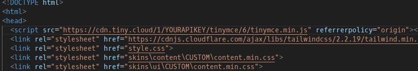

# beanfrog office suite thing idk
### In development semi-private clone of Google Docs, Drive, and eventually Slides.

## About
- Runs a localhost server for document storage. Program can (probably) be run in a cloud vm or other server hardware. (more in Installation/Use)
- DO NOT, under any circumstances, delete `coconut.jpg`. The project will not run without it.
- This is currently a proof-of-concept project.
- You must supply YOUR OWN TinyMCE api key.

## Installation and Use
- clone the repository or download the code as .zip and unpack
- open docs.html in a text editor and replace YOURAPIKEY in the script tag (shown in screenshot:)

- ensure `npm` and `nodejs` are installed on your system
- open a terminal and `cd` to the projects root directory
- enter `npm run start`

- Running on other hardware:
    - Support for running on other server hardware is currently untested
    - You should be able to run it on a server if you have a copy of THE ENTIRE REPO on that machine, and you have replaced any mentions of "localhost:3000" to the server's public ip and an open port (which you must change in server.js). "localhost:3000" is mentioned in drive.html and new.js.
    - Also have a copy of the repo on your machine and open drive.html or docs.html and as long as the server is running and the IP is accessible to http requests the project should run as expected
